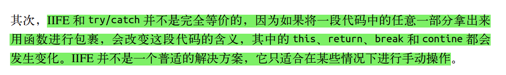

## 附录
### 动态作用域
> 动态作用域并不关心函数和作用域是如何声明以及在何处声明的, 动态作用域的作用域链基于调用栈，而不是代码书写时的作用域嵌套

```javascript
// 实际词法作用域
function foo() {
    console.log( a ); // 2
}
function bar() {
    var a = 3;
    foo();
}
var a = 2;
bar();
```

```javascript
// 如果动态作用域
function foo() {
    console.log( a ); // 3（不是 2 ！）
}
function bar() {
    var a = 3;
    foo();
}
var a = 2;
bar();
```

> 事实上js并不具有动态作用域，他只有词法作用域，但是js语言中的this机制很有动态作用域的意味
> 词法作用域关注何处声明，动态作用域关注何处调用，this也是关注何处调用的

### 块作用域的替代方案
+ try/catch catch分句 后面的{} 会包含块作用域（ES6之前的环境中可行）

```javascript
try{throw 2;}catch(a){
    console.log( a ); // 2
}
console.log( a ); // ReferenceError
```

> 强制抛出错误的 try/catch，但是它抛出的错误就是一个值 2，然后 catch 分句中的变量声明会接收到这个值

> 对上述做法的保有疑惑，为啥我不直接使用 IIFE来创建作用域？（尤其是try/catch还存有性能问题的前提下）




### this词法
> 看个 例子

```javascript
var obj = {
    id: "awesome",
    cool: function coolFn() {
        console.log( this.id );
    }
};
var id = "not awesome"
obj.cool(); // awesome
setTimeout( obj.cool, 100 ); // not awesome
setTimeout( 'obj.cool()', 100 ); // awesome
```

> setTimeout  和 setInterval 是window下的定时器函数，他们接收的第一个参数允许是一个函数或者是一段可执行的 JS 代码，第二个参数则是执行前面函数或者代码的时间间隔；
obj.cool 函数被当作值传递后， 100ms后执行时这个函数相当于被传递给window调用了，所以此时的 this指向window
'obj.cool()' 中是把一段可执行代码传递给了window，但是执行的时候window依然先找到obj对象，然后再有obj对象执行他的cool方法，调用者是obj，this指向obj

> 为了保有普通函数的写法，但是不希望this指向在某些场景的函数内部混乱（比如定时器函数的一个参数回调中的this） 我们可以使用 ES6箭头函数的特性来简化代码的书写

```javascript
var obj = {
    count: 0,
    cool: function coolFn() {
        if (this.count < 1) {
            setTimeout( function timer(){
                this.count++; // this 是安全的
                // 因为 bind(..)
                console.log( "more awesome" );
            }.bind( this ), 100); // look, bind()!
        }
    }
};
obj.cool(); // 更酷了
```
